# Image Inspector
This repository is about inspecting images and their instrinsics and extrinsics.

# Repo Overview

This repo consists of 4 parts. They are:
- **[Stereo Camera Image]()**
   - [RGB Image](https://github.com/ArghyaChatterjee/image-inspector/tree/main?tab=readme-ov-file#rgb-image)
   - [Depth Image](https://github.com/ArghyaChatterjee/image-inspector/tree/main?tab=readme-ov-file#depth-image)
- **[Stereo Camera Intrinsics]()**
   - [RGB Image]()
   - [Depth Image]()
- **[Stereo Camera Extrinsics]()**

# Setup the repo
## Clone the repo:
```bash
git clone https://github.com/ArghyaChatterjee/image-inspector.git
cd image-inspector/
```
---

## Create a Virtualenv:
```bash
python3 -m venv image_inspector_venv
source image_inspector_venv/bin/activate
pip3 install --upgrade pip
pip3 install -r requirements.txt
```
# Stereo Camera Image
## RGB Image
In an **RGB image**, the "image value" refers to the intensity of the **red (R)**, **green (G)**, and **blue (B)** color channels for each pixel in the image. These values determine the color and brightness of the pixel.

- **Pixel Values:** Each pixel in an RGB image has 3 components namely Red (R), Green (G), Blue (B). These components are represented as integer values in most image formats.

- **Range of Values:**
   - In **8-bit images** (the most common format for PNG/JPG), each channel ranges from **0 to 255**. Total combinations per pixel: `256` x `256` x `256` = 16,777,216 (16.7 million colors).
   - In **16-bit images** (less common, used for high-dynamic-range imaging): Each channel ranges from **0 to 65,535**.

- **Interpretation:**
   - **(0, 0, 0):** Black (no intensity in any channel).
   - **(255, 255, 255):** White (maximum intensity in all channels).
   - **(255, 0, 0):** Pure red (maximum red, no green or blue).
   - **(0, 255, 0):** Pure green.
   - **(0, 0, 255):** Pure blue.

- **Format Differences:**
   - **PNG:** Lossless compression, preserves exact pixel values.
   - **JPG:** Lossy compression, may slightly alter pixel values to reduce file size.

<table>
  <tr>
    <td>
      <figure>
        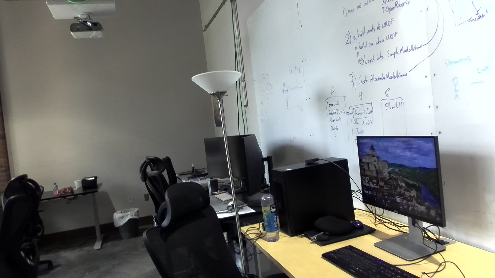
        <figcaption>Left Image</figcaption>
      </figure>
    </td>
    <td>
      <figure>
        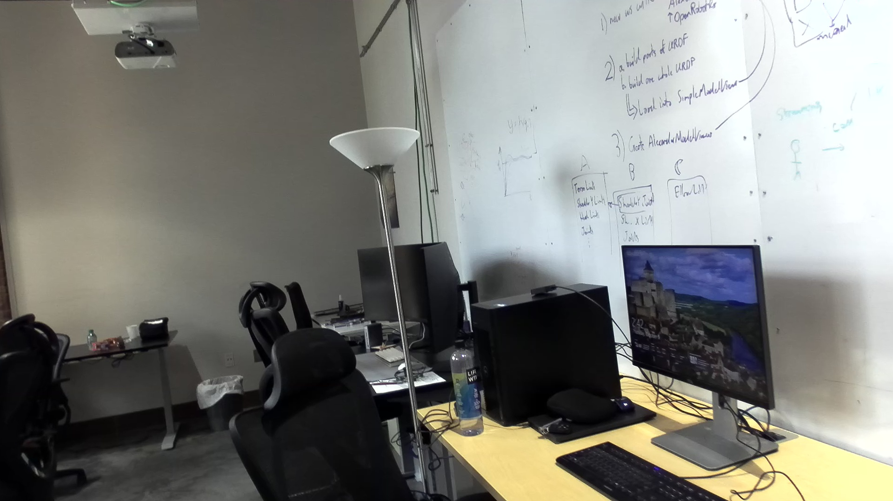
        <figcaption>Right Image</figcaption>
      </figure>
    </td>
  </tr>
</table>


### Standard Resolutions

<div align="center">
  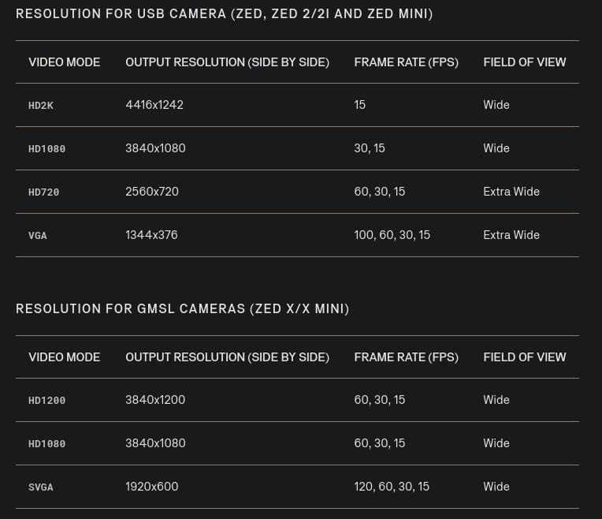
</div>

### Camera Control

Different parameters for camera configurations can be changed. Visit the camera control for zed [[here]](https://www.stereolabs.com/docs/video/camera-controls).

### Read as ROS2 topics
Pixel values can be read as ros 2 topics directly.
```
$ ros2 topic echo /zed/zed_node/left/image_rect_color
header:
  stamp:
    sec: 1732307124
    nanosec: 135420664
  frame_id: zed_left_camera_optical_frame
height: 1080
width: 1920
encoding: bgra8
is_bigendian: 0
step: 7680
data:
- 35
- 93
- 115
- 255
- 40
- 98
- 120
- 255
- 49
- '...'
---

```
### Read from PNG files
Pixel values range between 0-255 in a png/jpg file. Each pixel has 3 vales which are Blue, Green and Red. Here is how you can read them:
```python
cd scripts
python3 print_pixel_values_from_rgb_images.py
```
Here is the output:
```bash
RGB values for the entire image:
[[[167 158 205]
  [197 189 228]
  [225 219 245]
  ...
  [188 196 198]
  [188 196 198]
  [188 196 198]]

 [[167 158 205]
  [195 187 226]
  [224 218 244]
  ...

 [[ 46  41  35]
  [ 49  44  38]
  [ 49  44  38]
  ...
  [105 108 127]
  [102 105 124]
  [102 105 124]]]
RGB value at (100, 100): [135 125 126]
RGB value at (200, 150): [156 150 134]

Statistics for each channel:
Red channel - Min: 0, Max: 255, Mean: 100.545
Green channel - Min: 0, Max: 255, Mean: 101.240
Blue channel - Min: 0, Max: 255, Mean: 99.684
```

## Depth Image
- For unit8 type grayscaled depth images, they are 8 bit (0-255) depth images having a range of 0 m to 0.255 m. You can export them as jpg or png files. You can directly visualize color depth plots. 

- For unit16 type grayscaled depth images, they are 16 bit (0-65535) depth images having a range of 0 m to 65.535 m [[reference]](https://support.stereolabs.com/hc/en-us/articles/5365701074967-Why-is-the-depth-map-so-dark). You can export them as png files. You have to normalize them to 8 bit (0-255) to visualize color depth plots. 

- For float32 type grayscaled depth images, they are 32 bit ```(1.4×10^−45-3.4×10^38)``` depth images. Most depth cameras do not have a depth measurement range beyond several hundred meters. So, a float32 image can comfortably represent depth values, commonly from 0 m up to several kilometers (e.g., 3,400,000 meters), if needed. You have to normalize them to 8 bit (0-255) to visualize color depth plots. You can't export them as png files, you have to export as .exr (OpenEXR) or .tiff format (you can use GIMP to visualize them).

### Read as ROS2 topics
In ROS2 fir zed cameras, 32 bit float in meters and 16 bit unsigned int in millimeters are used.  

#### Depth values with 32 bit float value 
```
$ ros2 topic echo /zed/zed_node/depth/depth_registered
header:
  stamp:
    sec: 1732308300
    nanosec: 458677632
  frame_id: zed_left_camera_optical_frame
height: 1080
width: 1920
encoding: 32FC1
is_bigendian: 0
step: 7680
data:
- 71
- 153
- 12
- 63
- 170
- 184
- 12
- 63
- 244
- 234
- 12

- '...'
```
For the provided data, the encoding is **`32FC1`**, indicating a **32-bit floating-point** single-channel depth image. This means each depth value occupies 4 bytes and is directly stored as a floating-point number, unlike `mono16`, where the depth is an integer. 

1. **Encoding**

The **`32FC1` encoding** in a depth map refers to the following characteristics:
- **`32F`:**
   - Indicates that each pixel value is stored as a **32-bit floating-point number**.
   - This provides high precision, ideal for representing depth values in real-world units like meters.
- **`C1`:**
   - Indicates that the image has **1 channel** (grayscale image).
   - Each pixel represents a single depth value rather than color or RGB channels.
- **Encoding:** `32FC1` (floating-point depth values).
- **Pixel Values:** Each pixel represents the distance (depth) from the camera to the observed surface, typically in meters.
- **Resolution:**
  - **Height:** 1080 pixels.
  - **Width:** 1920 pixels.
- **Step:** `7680`
  - This is the number of bytes per row in the image.
  - For `32FC1`:
    - Each pixel is 4 bytes (32 bits).
    - Step = `width` x 4).
    - (1920 x 4 = 7680).
- **`is_bigendian`:**
  - `0` indicates the data is in **little-endian** format (common in most systems).
     - The least significant byte (LSB) comes first, followed by more significant bytes. 

2. **Converting Data**
- Each depth value is represented by 4 consecutive bytes.
- For example:
  - First 4 bytes: `42`, `10`, `13`, `63`
  - These bytes are stored in reverse order (little-endian). Convert them into a 32-bit float.

- **Conversion Process**
   - Arrange bytes in the correct order: `63`, `13`, `10`, `42`.
   - Interpret them as a 32-bit floating-point number.

- **Example Conversion**
   1. Bytes: `42`, `10`, `13`, `63`
      - Rearrange: `63`, `13`, `10`, `42`.
      - Convert to a 32-bit float:
        - Using a converter or Python's `struct` module, this gives: **0.577** (meters).

   2. Next bytes: `148`, `37`, `13`, `63`
      - Rearrange: `63`, `13`, `37`, `148`.
      - Convert to a float: **0.606** (meters).

   3. Repeat for the subsequent 4-byte groups.

---

3. **Depth Values for the Data**
   
Here are the first few depth values (converted):

| Bytes (Reordered)    | Depth (Meters) |
|-----------------------|----------------|
| `63 13 10 42`        | 0.577          |
| `63 13 37 148`       | 0.606          |
| `63 13 85 222`       | 0.655          |
| `63 13 136 40`       | 0.704          |
| `63 13 181 185`      | 0.753          |
| `63 13 208 94`       | 0.801          |

---

4. **Depth Range**
   
The metadata indicates:
- **Min Depth:** 0.507 meters
- **Max Depth:** 4.605 meters

The data values fall within this range.

The `32FC1` encoding represents each depth value as a 32-bit floating-point number in meters. The `data` array contains byte values that need to be grouped in sets of 4 and rearranged according to little-endian format before converting them to floating-point numbers. These values correspond to distances in meters within the range 0.507 m to 4.605 m. 

#### Depth values with 16 bit unsigned integer value 
```
$ ros2 topic echo /zed/zed_node/depth/depth_registered
header:
  stamp:
    sec: 1732402536
    nanosec: 805272400
  frame_id: zed_left_camera_optical_frame
height: 1080
width: 1920
encoding: mono16
is_bigendian: 0
step: 3840
data:
data:
- 92
- 3
- 93
- 3
- 94
- 3
- 95
- 3
- 97
- 3
- 98
- 3
- 99
- 3
- '...'
```
1. **Encoding:**
   - **`mono16`** indicates that each pixel is represented as a **16-bit unsigned integer** (2 bytes per pixel).
   - Depth is typically expressed in **millimeters** for `mono16`.

2. **Endianess:**
   - **Little-endian (is_bigendian = 0):** The least significant byte (LSB) comes first, followed by the most significant byte (MSB).
   - Each depth value is represented by two consecutive integers in the `data` field, where:
     - `value = MSB × 256 + LSB`

3. **Example Conversions:**
   - From the provided data:
     ```
     - 92
     - 3
     ```
     These two numbers represent a single depth value:
     - Depth = 3 x 256 + 92 = 844 mm

   - Next depth value:
     ```
     - 93
     - 3
     ```
     - Depth = 3 x 256 + 93 = 845 mm

   - Continuing this pattern, we can interpret subsequent depth values:
     - Depth = 3 x 256 + 94 = 846 mm
     - Depth = 3 x 256 + 95 = 847 mm

4. **General Pattern:**
   - The depth values gradually increase, which likely corresponds to distances in the scene.

5. **Depth Values for the Provided Data:**

Using the above interpretation:

| LSB | MSB | Depth (mm) |
|-----|-----|------------|
| 92  | 3   | 844        |
| 93  | 3   | 845        |
| 94  | 3   | 846        |
| 95  | 3   | 847        |
| 97  | 3   | 849        |
| 98  | 3   | 850        |
| 99  | 3   | 851        |
| 100 | 3   | 852        |
| 101 | 3   | 853        |
| 103 | 3   | 855        |
| ... | ... | ...        |

6. **Depth Range**
- The data seems to correspond to increasing depths in millimeters.
- It aligns well with the **min_depth** (~755 mm) and **max_depth** (~17,121 mm) values mentioned earlier.

Each pair of numbers in the `data` field represents a depth value in millimeters, with the MSB coming second. These values can be directly converted to real-world depths by calculating `Depth` = `MSB` x `256` + `LSB`. 

### Read PNG files
The depth values are in millimeters. You can print the depth values in millimeters:
```bash
cd scripts
python3 print_depth_values_from_depth_image.py 
```
Here is the output:
```bash
Depth values (in millimeters):
[[4769 4773 4780 ... 1658 1654 1650]
 [4763 4768 4776 ... 1661 1657 1654]
 [4757 4763 4772 ... 1664 1660 1657]
 ...
 [1931 1934 1938 ... 1126 1126 1125]
 [1929 1932 1935 ... 1125 1125 1124]
 [1928 1929 1932 ... 1123 1123 1123]]
Depth at (100, 100): 5128 mm
Depth at (200, 150): 5281 mm
Minimum depth: 0 mm
Maximum depth: 9375 mm
Mean depth: 3573.328840181327 mm
```
If you want to use the depth maps in meters, convert the values of each depth map from millimeters to meters by dividing with 1000. 

   <div align="center">
     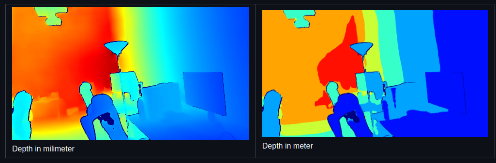
   </div>

For Depth Image Info, you can see the smallest and largest value of the depth map. Here is an example:
```
ros2 topic echo /zed/zed_node/depth/depth_info
header:
  stamp:
    sec: 0
    nanosec: 0
  frame_id: zed_left_camera_optical_frame
min_depth: 0.6266739368438721
max_depth: 7.9091668128967285
```
---

# Stereo Camera Intrinsics
## RGB Image 

For zed camera, Distortion factor : [k1, k2, p1, p2, k3, k4, k5, k6, s1, s2, s3, s4]. Radial (k1, k2, k3, k4, k5, k6), Tangential (p1,p2) and Prism (s1, s2, s3, s4) distortion [[reference]](https://www.stereolabs.com/docs/api/python/classpyzed_1_1sl_1_1CameraParameters.html)

The **rational polynomial** and **plumb bob / radial tangential** models are prominent methods for modeling lens distortion in camera calibration. Here's a detailed comparison of the two:

### 1. Rational Polynomial Model
- **Key Idea**: Uses rational polynomials to model lens distortion, which means it applies a polynomial for both the numerator and denominator of a rational function to represent distortion effects.
- **Distortion Parameters**: 
  - Radial distortion is modeled using terms like r^2, r^4, r^6, ...
  - Tangential distortion can also be incorporated if needed.

<div align="left">
  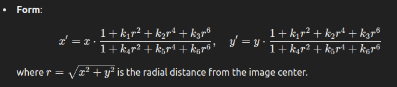
</div>

- **Flexibility**: More flexible than simpler models because the rational polynomial can fit more complex distortion patterns, especially for wide-angle or fisheye lenses.

### 2. Plumb Bob / Radial Tangential Model
- **Key Idea**: A simpler model that primarily focuses on radial and tangential distortion components. It is often referred to as the **pinhole camera model with distortion**.
- **Distortion Parameters**:
  - Radial distortion (k_1, k_2, k_3), etc.) to account for barrel or pincushion effects.
  - Tangential distortion (p_1, p_2) to model lens misalignment.
    
<div align="left">
  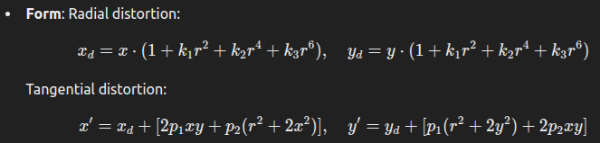
</div>

- **Flexibility**: Less flexible compared to the rational polynomial model, as it uses only polynomial terms to model distortions.

### **Comparison Summary**
| **Aspect**            | **Rational Polynomial Model**            | **Plumb Bob / Radial Tangential Model**     |
|------------------------|------------------------------------------|--------------------------------------------|
| **Complexity**         | More complex, can handle intricate distortions | Simpler, focuses on radial and tangential distortion |
| **Distortion Types**   | Radial (high degree), tangential         | Radial (low degree), tangential            |
| **Use Case**           | High-precision, wide-angle, fisheye lenses | Conventional lenses, general-purpose       |
| **Flexibility**        | Higher                                  | Moderate                                   |
| **Computation**        | More computationally intensive          | Less computationally intensive             |
| **Standards**          | Used in advanced calibration tasks       | Common in OpenCV and standard tools        |


- If you need a model for high-precision applications with complex distortion, go for the **rational polynomial model**.
- For most standard cameras (opencv) and typical calibration tasks, the **plumb bob model** is simpler and sufficient.

### **Different Types of Distortion Models**
1. **Plumb Bob / Radial-Tangential**
   - Commonly used in most camera calibration tools (e.g., OpenCV).
   - Supports radial and tangential distortion.
   - **Expected Values**: **5 coefficients**:
     - `k1`, `k2` (radial distortion coefficients).
     - `p1`, `p2` (tangential distortion coefficients).
     - `k3` (higher-order radial distortion).

   Example:
   ```python
   camera_info.d = [k1, k2, p1, p2, k3]
   ```

2. **Equidistant (Fisheye Model)**
   - Often used for fisheye or wide-angle cameras.
   - **Expected Values**: **4 coefficients**:
     - `k1`, `k2` (radial distortion coefficients).
     - `k3`, `k4` (higher-order radial distortion).

   Example:
   ```python
   camera_info.d = [k1, k2, k3, k4]
   ```

3. **Omnidirectional**
   - Used for omnidirectional or 360-degree cameras.
   - Can support a variable number of coefficients depending on the calibration.

### **Rectified vs. Raw Images**
1. **Rectified Images**
   - The distortion has already been corrected.
   - **`camera_info.d` for rectified images**:
     - The number of values will match the distortion model (typically 5 for "plumb_bob").
   
   Example:
   ```python
   camera_info.d = [0.0, 0.0, 0.0, 0.0, 0.0]
   ```
   - Even if your model allows more coefficients, all are set to **0** since the rectification removes distortions.

2. **Raw Images**
   - The distortion is present and needs to be corrected using the coefficients.
   - **`camera_info.d` for raw images**:
     - The number of values will match the distortion model (typically 5 for "plumb_bob").

   Example:
   ```python
   camera_info.d = [-0.174526006, 0.0277379993, 0.0000997691, -0.000323628, 0.0]
   ```

### **Key Difference**
- **Rectified**: `camera_info.d` values are all zeros (no distortion present).
- **Raw**: `camera_info.d` contains non-zero coefficients that describe the lens distortion.

---

## Depth Image
Depth images have associated **camera info**. The **camera info** provides essential calibration and metadata about the camera that captured the depth image. This information is critical for interpreting depth values correctly and for projecting depth pixels into 3D space.

### Camera Info for Depth Images
Depth images typically provide per-pixel depth values, where each pixel represents the distance to a surface in the scene. To use this data effectively (e.g., to compute 3D coordinates), you need the following information, often provided in the **camera info** message:

1. **Camera Intrinsics**:
   - **Intrinsic Matrix (K)**: Maps pixel coordinates to 3D camera coordinates.
     - Format:
       ```
       K = [fx,  0, cx,
             0, fy, cy,
             0,  0,  1]
       ```
       Where:
       - `fx` and `fy` are the focal lengths in pixels.
       - `cx` and `cy` are the optical center coordinates (principal point).

2. **Projection Matrix (P)**:
   - Used to project 3D points into the 2D image plane.
   - Includes additional parameters for stereo cameras.

3. **Distortion Model and Coefficients**:
   - If the depth image is raw (not rectified), these parameters describe the lens distortions.
   - Rectified depth images typically have zero distortion coefficients.

4. **Resolution**:
   - The height and width of the depth image, which must match the dimensions of the camera info.

5. **Frame ID**:
   - Indicates the coordinate frame associated with the depth image (e.g., `left_camera` or `depth_camera`).

### How to Use Camera Info with Depth Images
1. **Project Depth to 3D**:
   - Using the intrinsic matrix `K`, you can compute the 3D position of any pixel (`u`, `v`) with depth `D`:

   <div align="center">
     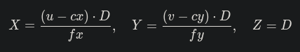
   </div>
   
     Where X, Y, Z are the 3D coordinates in the camera frame.

2. **Stereo Depth**:
   - For stereo cameras, the projection matrix `P` also includes the baseline (distance between the two cameras), which is critical for converting disparity to depth.

3. **Point Cloud Generation**:
   - Depth images and camera info are combined to generate point clouds in the camera's coordinate frame.

### Example of Camera Info for Depth Images
Here’s how a typical `CameraInfo` message might look for a depth camera:

```python
camera_info = CameraInfo()
camera_info.header.stamp = <timestamp>
camera_info.header.frame_id = "depth_camera"
camera_info.height = 720
camera_info.width = 1280
camera_info.distortion_model = "plumb_bob"  # Or "none" for rectified images
camera_info.d = [-0.1, 0.01, 0.0, 0.0, 0.0]  # Distortion coefficients
camera_info.k = [700.0, 0.0, 640.0, 0.0, 700.0, 360.0, 0.0, 0.0, 1.0]  # Intrinsic matrix
camera_info.r = [1.0, 0.0, 0.0, 0.0, 1.0, 0.0, 0.0, 0.0, 1.0]  # Rectification matrix
camera_info.p = [700.0, 0.0, 640.0, 0.0, 0.0, 700.0, 360.0, 0.0, 0.0, 0.0, 1.0, 0.0]  # Projection matrix
```

### How to Attach Camera Info to Depth Images in ROS 2
When publishing depth images, you can also publish the corresponding `CameraInfo` on a separate topic. For example:

- Depth Image Topic: `/camera/depth/image_raw`
- Camera Info Topic: `/camera/depth/camera_info`

The subscriber can then synchronize the two topics using tools like `message_filters` in ROS.

### How to Check If Your Depth Images Have Camera Info
1. **Inspect the Camera Info Topic**:
   Use `ros2 topic echo /camera/depth/camera_info` to see if the camera info is published.

2. **Check the Data**:
   Look for parameters like `K`, `P`, and `distortion_model` in the output.

---

## Intrinsics Matrix Derivation

The intrinsic parameters and camera matrices are typically obtained from the **camera calibration process**. Here's how each value is derived or determined:

### 1. Intrinsic Matrix (`camera_info.k`)
The intrinsic matrix defines how a 3D point in the camera's coordinate system is projected onto the 2D image plane.

<div align="center">
  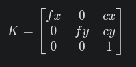
</div>

- **`fx`, `fy` (Focal Lengths)**:
  - These are the scaling factors for pixels in the x and y directions, measured in pixels.
  - These are derived from the physical focal length of the lens (in mm) and the pixel size of the camera sensor.

- **`cx`, `cy` (Principal Point)**:
  - These represent the optical center of the image in pixel coordinates. Ideally, this is at the center of the image, but due to imperfections, it might be slightly offset.
  - These values are computed during calibration.

- **How Your Values Are Incorporated**:
  ```
  camera_info.k = [1388.96728515625, 0.0, 954.34521484375, 
                   0.0, 1388.96728515625, 531.0472412109375, 
                   0.0, 0.0, 1.0]
  ```

### 2. Distortion Coefficients (`camera_info.d`)
Distortion coefficients correct for lens distortions, such as:
- **Radial distortion** (barrel or pincushion distortion).
- **Tangential distortion** (caused by misalignment of the lens).

Distortion coefficients typically follow the model:

<div align="center">
  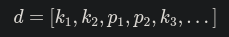
</div>

- `k_1, k_2, k_3`: Radial distortion coefficients.
- `p_1, p_2`: Tangential distortion coefficients.

In this case:
- Distortion coefficients are all **zero** (`[0. 0. 0. ...]`), indicating rectified images where distortions have already been removed.

### 3. Rectification Matrix (`camera_info.r`)
The rectification matrix aligns the images from stereo cameras so that their epipolar lines become parallel. For rectified cameras, this is often an identity matrix:

<div align="center">
  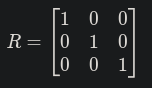
</div>

This is consistent with the values:
```
camera_info.r = [1.0, 0.0, 0.0, 
                 0.0, 1.0, 0.0, 
                 0.0, 0.0, 1.0]
```

### 4. Projection Matrix (`camera_info.p`)

The projection matrix maps 3D points to 2D image coordinates, incorporating the intrinsic matrix and additional parameters like stereo baseline for the right camera.

For a stereo camera:

<div align="center">
  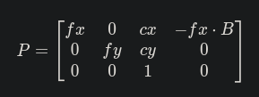
</div>

- **Baseline (B)**:
  - The distance between the left and right cameras.
  - The value `-fx * B` is present only in the right camera's projection matrix.

For zed cameras:
- Left Camera:
  ```
  camera_info.p = [1388.96728515625, 0.0, 954.34521484375, 0.0, 
                   0.0, 1388.96728515625, 531.0472412109375, 0.0, 
                   0.0, 0.0, 1.0, 0.0]
  ```

- Right Camera:
  ```
  camera_info.p = [1388.96728515625, 0.0, 954.34521484375, -B, 
                   0.0, 1388.96728515625, 531.0472412109375, 0.0, 
                   0.0, 0.0, 1.0, 0.0]
  ```
  (Here, `-B` would be the negative baseline multiplied by `fx`).


### 5. Image Size

Image resolution is derived directly from the camera or dataset:
- **Image Width**: 1920
- **Image Height**: 1080

This information is explicitly used to define the image size.

### **How Are These Values Obtained?**
The values are typically obtained through a **camera calibration process**, such as:

1. **Calibration with a Checkerboard**:
   - A calibration tool (e.g., OpenCV, MATLAB, or ROS `camera_calibration` package) uses a checkerboard or a known calibration pattern.
   - Images of the pattern are captured from the camera and used to compute intrinsics, distortion coefficients, and extrinsics.

   Example in OpenCV:
   ```python
   ret, mtx, dist, rvecs, tvecs = cv2.calibrateCamera(objpoints, imgpoints, imageSize, None, None)
   ```

2. **Camera Calibration Tools**:
   - Tools like the ROS `camera_calibration` package or the ZED SDK provide automated calibration procedures.
   - They output the intrinsic parameters directly.

3. **Stereo Calibration**:
   - If you're using stereo cameras, a stereo calibration process computes the rectification matrix (`R`) and projection matrix (`P`) in addition to individual camera intrinsics.

### Generate camera info parameters for ROS
To use these intrinsics in ROS, encode them into the `CameraInfo` message directly, as shown in the code.

Example:
```python
from sensor_msgs.msg import CameraInfo

camera_info = CameraInfo()
camera_info.height = 1080
camera_info.width = 1920
camera_info.distortion_model = "plumb_bob"
camera_info.d = [0.0, 0.0, 0.0, 0.0, 0.0]
camera_info.k = [1388.96728515625, 0.0, 954.34521484375,
                 0.0, 1388.96728515625, 531.0472412109375,
                 0.0, 0.0, 1.0]
camera_info.r = [1.0, 0.0, 0.0, 0.0, 1.0, 0.0, 0.0, 0.0, 1.0]
camera_info.p = [1388.96728515625, 0.0, 954.34521484375, 0.0,
                 0.0, 1388.96728515625, 531.0472412109375, 0.0,
                 0.0, 0.0, 1.0, 0.0]
```

In the context of stereo cameras, the **baseline** refers to the physical distance between the optical centers of the left and right cameras. This baseline is critical for calculating depth from stereo images because it directly influences the disparity between corresponding points in the left and right images.

### **What Does `-B` Mean?**
In the **projection matrix** for the right camera, `-B` appears as part of the translation term. Specifically:

<div align="center">
  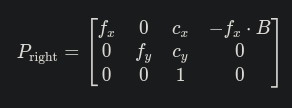
</div>

Here:
- `f_x`: Focal length in the x-direction (in pixels).
- `c_x, c_y`: Principal point coordinates.
- `B`: Baseline distance between the left and right cameras (in meters).

### Reason for `-B` is Multiplied by `f_x` ?
The term `-f_x` \ `B` arises because the projection matrix incorporates both the camera's intrinsics and its relative position in space. The translation `-f_x` \ `B` shifts the x-coordinate in the right camera's view to account for the offset caused by the baseline.

- `B` is measured in **meters**, but the focal length `f_x` is in **pixels**. The multiplication `-f_x` \ `B` ensures the translation is represented in **pixels**, aligning with the other terms in the projection matrix.

This term allows stereo matching algorithms to compute the disparity between the left and right images, which is the key to estimating depth. 

Disparity `d` is defined as:

<div align="center">
   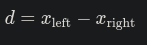
</div>

Using the disparity, the depth `Z` of a point can be calculated as:

<div align="center">
   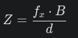
</div>

- When `-f_x` \ `B` is correctly encoded in the projection matrix of the right camera, it simplifies stereo computations.

### Example: Computing `-B`
1. Suppose:
   - **Baseline** `B`: 0.1 m (10 cm between the left and right cameras).
   - **Focal Length** `f_x`: 1388.967 pixels.

2. The translation term for the right camera becomes:

<div align="center">
   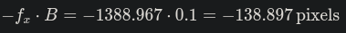
</div>

4. The right camera's projection matrix would then be:

<div align="center">
  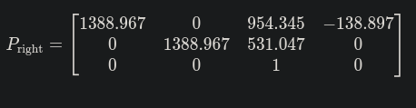
</div>

The term `-B` in the projection matrix represents the baseline offset, translated into pixel units using the focal length `f_x`. This ensures the stereo cameras are correctly modeled for depth estimation. Without this term, depth computations from stereo images would not be possible.

### ROS1 Example:
```
$ rostopic echo /tesse/left_cam/camera_info
header: 
  seq: 642
  stamp: 
    secs: 46
    nsecs: 404879999
  frame_id: "left_cam"
height: 480
width: 720
distortion_model: "radial-tangential"
D: [0.0, 0.0, 0.0, 0.0]
K: [415.69219381653056, 0.0, 360.0, 0.0, 415.69219381653056, 240.0, 0.0, 0.0, 1.0]
R: [1.0, 0.0, 0.0, 0.0, 1.0, 0.0, 0.0, 0.0, 1.0]
P: [415.69219381653056, 0.0, 360.0, 0.0, 0.0, 415.69219381653056, 240.0, 0.0, 0.0, 0.0, 1.0, 0.0]
binning_x: 0
binning_y: 0
roi: 
  x_offset: 0
  y_offset: 0
  height: 0
  width: 0
  do_rectify: False
```
### ROS2 Example
#### Left Camera Image

```
/zed/zed_node/left/camera_info
header:
  stamp:
    sec: 1732143447
    nanosec: 236044975
  frame_id: zed_left_camera_optical_frame
height: 1080
width: 1920
distortion_model: plumb_bob
d:
- 0.0
- 0.0
- 0.0
- 0.0
- 0.0
k:
- 1388.7547607421875
- 0.0
- 954.3450927734375
- 0.0
- 1388.7547607421875
- 531.047119140625
- 0.0
- 0.0
- 1.0
r:
- 1.0
- 0.0
- 0.0
- 0.0
- 1.0
- 0.0
- 0.0
- 0.0
- 1.0
p:
- 1388.7547607421875
- 0.0
- 954.3450927734375
- 0.0
- 0.0
- 1388.7547607421875
- 531.047119140625
- 0.0
- 0.0
- 0.0
- 1.0
- 0.0
binning_x: 0
binning_y: 0
roi:
  x_offset: 0
  y_offset: 0
  height: 0
  width: 0
  do_rectify: false (edited) 
```

#### Right Camera Image

```
/zed/zed_node/right/camera_info
header:
  stamp:
    sec: 1732143617
    nanosec: 31675975
  frame_id: zed_right_camera_optical_frame
height: 1080
width: 1920
distortion_model: plumb_bob
d:
- 0.0
- 0.0
- 0.0
- 0.0
- 0.0
k:
- 1388.7547607421875
- 0.0
- 954.3450927734375
- 0.0
- 1388.7547607421875
- 531.047119140625
- 0.0
- 0.0
- 1.0
r:
- 1.0
- 0.0
- 0.0
- 0.0
- 1.0
- 0.0
- 0.0
- 0.0
- 1.0
p:
- 1388.7547607421875
- 0.0
- 954.3450927734375
- -87.42100524902344
- 0.0
- 1388.7547607421875
- 531.047119140625
- 0.0
- 0.0
- 0.0
- 1.0
- 0.0
binning_x: 0
binning_y: 0
roi:
  x_offset: 0
  y_offset: 0
  height: 0
  width: 0
  do_rectify: false
```

# Stereo Camera Extrinsics

Camera **extrinsics** describe the spatial relationship between 2 camera pairs. They include:

1. **Translation (t):** The position of the camera in the world coordinate system, typically represented as a 3D vector `(x, y, z)`.
2. **Rotation (R):** The orientation of the camera relative to the world, represented as a rotation matrix `(3x3)` or equivalent representations like Euler angles or quaternions.

Together, extrinsics are represented by a **4x4 transformation matrix**:

<div align="center">
  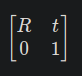
</div>

This matrix transforms 3D points from the **left camera coordinate system** into the **right camera coordinate system**.

### **Find Camera Extrinsics**

In the ROS2 topics, **camera extrinsics are not explicitly included**. However, they can usually be found in the following contexts:

1. **Camera Info Topic**
The `/camera_info` or equivalent topic often contains **intrinsics** and sometimes hints about extrinsics (e.g., `R` and `P` matrices for stereo cameras). For the ZED camera, extrinsics between the left and right cameras can be deduced from the stereo baseline.

2. **TF Transforms**
Extrinsics are frequently provided in the form of **TF (transform)** data, which defines the spatial relationship between frames in the robot's coordinate system. For example:
- TF topics need to be looked at to find its relationship with other frames (e.g., `left_camera_link` or `right_camera_link`).
- Use the command:
  ```bash
  ros2 topic echo /tf
  ```

3. **Calibration File**
Extrinsics are typically saved in the camera's calibration files, which ZED provides for stereo setups. These files include:
- **Rotation matrix (R):** Transform between the left and right cameras.
- **Translation vector (t):** The stereo baseline distance.

### **ZED Camera Extrinsics in a Stereo Setup**
For the ZED camera:
- **Left Camera Frame:** The primary frame, often aligned with the global/world frame.
- **Right Camera Frame:** The extrinsics are typically defined as a transformation from the left to the right camera:

<div align="center">
  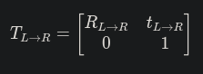
</div>

### **Retrieve Extrinsics**

1. **Look in the TF Tree:**
   - Run:
     ```bash
     ros2 run tf2_tools view_frames
     ```
   - This will generate a TF tree where you can see the transformations involving the ZED camera.

2. **Query a Transform:**
   - For example, to find the extrinsics between the left and the right camera frame:
     ```bash
     ros2 run tf2_ros tf2_echo zed_left_camera_frame zed_right_camera_frame
     ```
   - This will give you the rotation (quaternion) and translation.

3. **Export Calibration Data:**
   - If using ZED SDK:
     ```bash
     ZED_DepthViewer -o
     ```
   - The exported `.conf` or `.yaml` file contains extrinsics.

### **Camera Info Topic and its Role**

The **camera info topic** (e.g., `/zed/zed_node/left/camera_info`) provides essential calibration parameters for a camera, including:

1. **Intrinsics** – Describe the camera's internal parameters.
2. **Distortion Coefficients** – Used for correcting lens distortion.
3. **Extrinsics (for stereo cameras)** – Indirectly describe the spatial relationship between paired cameras (e.g., left and right in stereo setups).

### **Structure of Camera Info**

The `/camera_info` message generally contains fields like:

```plaintext
header:
  frame_id: zed_left_camera_optical_frame
height: 1080
width: 1920
distortion_model: plumb_bob
D: [distortion_coefficients]
K: [fx, 0, cx,
    0, fy, cy,
    0,  0,  1]  # Intrinsic Matrix
R: [rotation_matrix]  # Extrinsics between stereo cameras
P: [fx', 0, cx', Tx,
    0, fy', cy', Ty,
    0,  0,   1,  0]  # Projection Matrix
```

### **Role of Intrinsics**

- The **K matrix** represents the camera's intrinsic parameters, such as:
  - `(f_x, f_y)`: Focal lengths in pixels along the `x` and `y` axes.
  - `(c_x, c_y)`: Principal point offsets (center of the image).

### **Role of Extrinsics in Stereo Cameras**

For stereo cameras like ZED, extrinsics define the spatial relationship between the **left and right cameras**. These relationships are captured in:

1. **R (Rotation Matrix):** The 3x3 rotation matrix from the left camera to the right camera.
   - Represents how the right camera is oriented relative to the left.
   - Usually close to the identity matrix if the cameras are well-aligned.

2. **P (Projection Matrix):**
   - Combines intrinsic and extrinsic information.
   - Contains a baseline translation `T_x` or `T_y` (depending on stereo configuration).
   - `T_x` = `-f_x` \ `baseline`, where "baseline" is the physical distance between the cameras.

### **Deducing Extrinsics Between Stereo Cameras**

#### From `R` (Rotation Matrix)
The matrix `R` defines the orientation difference between the left and right cameras. This is a **relative rotation**.

#### From `P` (Projection Matrix)
The fourth column of `P` gives the **translation component**:
- The `T_x` value directly corresponds to the **baseline distance**:

<div align="center">
  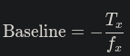
</div>

This measures the distance between the left and right cameras in meters.

### **ZED Camera ROS2 Wrapper**

In the ZED ROS2 wrapper, the `/camera_info` topic for the left and right cameras contains the matrices `R` and `P`. Here’s how to interpret them:

- **Left Camera:** 
  - `P` includes the left camera's intrinsic parameters, and `T_x` = 0.
- **Right Camera:** 
  - `P` includes the right camera's intrinsic parameters and the baseline distance `T_x`.
  - `R` contains the rotation between the cameras (often identity).

- The extrinsics between the **left and right cameras** can be calculated as:
  - **Translation (baseline):** Use `T_x` from the right camera's `P` matrix.
  - **Rotation:** Use `R` matrix from the camera info.

### Calculate the Baseline

The **baseline** is the distance between the optical centers of the left and right cameras. It can be calculated using the **projection matrix (P)** of the right camera, specifically the element at position (1, 4) (zero-based indexing, `P[0][3]`). This value represents the translation of the right camera relative to the left camera in the x-axis, scaled by the focal length (`fx`).

#### Right Camera Projection Matrix
From the provided data:
```yaml
p:
- 1388.7547607421875  # fx (focal length)
- 0.0
- 954.3450927734375  # cx (principal point x)
- -87.42100524902344  # baseline * fx
- 0.0
- 1388.7547607421875  # fy (focal length)
- 531.047119140625  # cy (principal point y)
- 0.0
- 0.0
- 0.0
- 1.0
- 0.0
```

#### Formula for Baseline
The baseline can be extracted as:

<div align="center">
  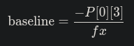
</div>

Where:
- `P[0][3]` = `-87.42100524902344` (right camera projection matrix, 4th element in the first row).
- `fx` = `1388.7547607421875` (focal length).

#### Calculation

<div align="center">
  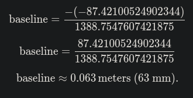
</div>

---

The **baseline** is approximately **0.063 meters** or **63 mm**.


